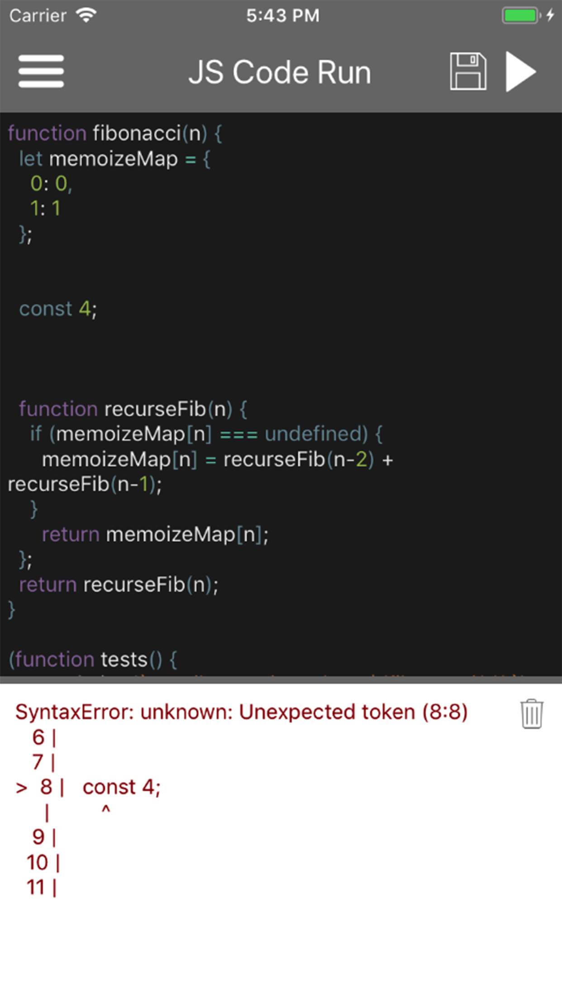
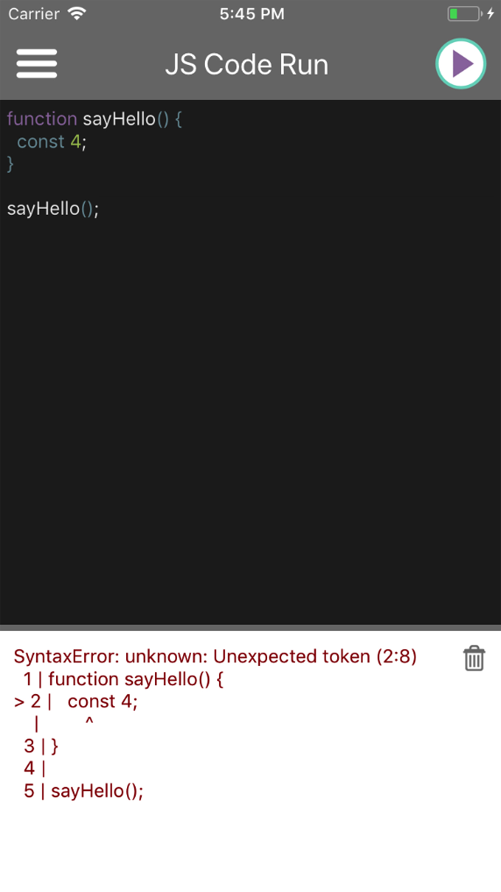
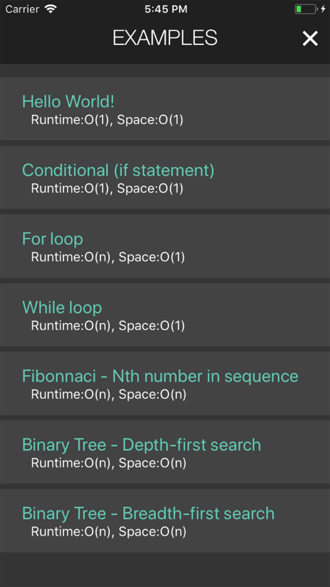

# JS Code Run (JavaScript Editor)

Available in the [App Store](https://itunes.apple.com/us/app/js-code-run/id1294015040?mt=8 "App Store") and [Play Store](https://play.google.com/store/apps/details?id=me.tacchino.jscoderunner "Play Store").

<span>

</span>

JS Code Run is a full-featured code editor for running JavaScript on your mobile device, built with React Native.

## Getting Started
### Prerequisites

See the [getting started page for React Native](https://facebook.github.io/react-native/docs/getting-started "Getting Started") to get your development environment up and running.

Then
```
yarn install
```
and
```
yarn ios
yarn android
```
to run the project on iOS or Android.

## Running the tests

Jest is used for unit testing. To run the tests use:
```
yarn test
```
